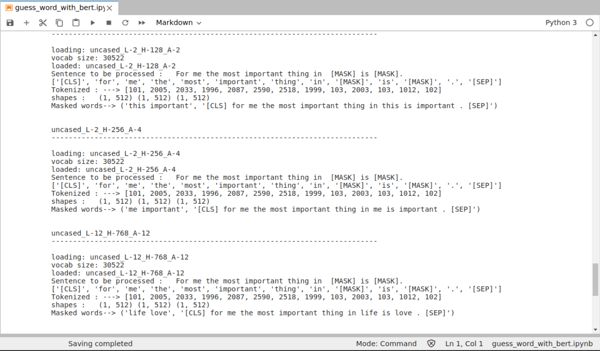
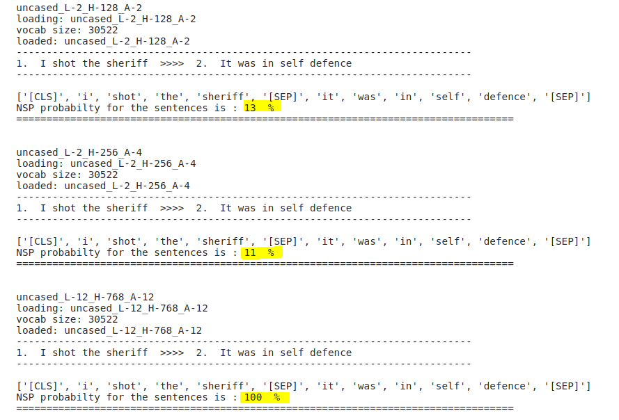

## Project Name
>English to german/spanish translator local/server using T5 model or Marian MT.


### General info
If you need to  translate  text from english  to german/french/spanish 
you could use one of many online translator services. They are convenient and quick.
If you are a company/private and don't want to share, sometimes confident information having own local translator could be better solution.
With a bit more than a 3 lines of code old machine all that is possible. Key word is 'transformers'.
Transformer models have taken the world of natural language processing (NLP) by storm and Hugging Face is a company
which empowered everybody with powerfull tools: open-source libraries, and pretrained models( among them [T5](https://huggingface.co/transformers/v2.7.0/model_doc/t5.html#tft5model)).
There actually more line of code taking care about cosmetic of two used widgets compared to translation. 

#### _comparing local and online translator result_ 


#### There two extra notebooks: (Part_A_files_preprocess_NTLK_spliting_by_sentence.ipynb, Part_B_files_text_translators_eng_to_de_es_pl.ipynb ) to be used with  T5 and MarianMT models for translation of text files.

* [First file:](Part_A_files_preprocess_NTLK_spliting_by_sentence.ipynb) is responsible for text file preprocessing.
* [Second file:](Part_B_files_text_translators_eng_to_de_pl.ipynb) makes text file translation.

All model names use the following format: Helsinki-NLP/opus-mt-{src}-{tgt}
Since Marian models are smaller than many other translation models available in the library, they can be useful for fine-tuning experiments and integration tests.


#### _translation to spanish_


---

## Playing with BERT base fucionality locally MSM mode
[guess_word_with_bert.ipynb:](https://github.com/len-sla/NLP/blob/master/guess_word_with_bert.ipynb)

Notebook shows how BERT predicts `[MASK]`-ed words(MLM mode).
There is also another mode ie NSP( not presented here).

Downloaded different sizes of the BERT models are used 
token_input, seg_input, mask_input are generated based on given sentence with MASK-ed words
`BERT` expect that those 3 vectors will be  512 long : `token_input`, `seg_input` and  `mask_input`.

`token_input` as a first token has `[CLS]` and sentence ends with `[SEP]`. In case only one sentence there is one  `[SEP]` if there are two sentences there are two  `[SEP]`.
Additionally  `token_input` could have `[MASK]`.
Places where  `token_input` has `[MASK]` in vector `mask_input` have "1" (other places are "0").




---

## Playing with BERT base fucionality locally NSP mode
[nsp_compare_sentences.ipynb:](https://github.com/len-sla/NLP/blob/master/nsp_compare_sentences.ipynb)

Notebook shows how BERT predicts next sentence(NSP mode).





---
## Predicting BERT in equal sizes
[predict_bert_equal_batches.ipynb:](https://github.com/len-sla/NLP/blob/master/predict_bert_equal_batches.ipynb)

This notebook shows how you can use Google Colab with free GPU to get Bert model predictions. Generally it is nothing special except the times where there is not enough GPU memory to do the task. To make it possible traing set is being traine in batches. Below there is example BERT model = 'cased_L-12_H-768_A-12' is used

---


### Libraries
* Hugging Face transformers [MarianMT](https://huggingface.co/transformers/model_doc/marian.html).
* Hugging Face transformers [T5](https://huggingface.co/transformers/v2.7.0/model_doc/t5.html#tft5model).
 > model = AutoModelWithLMHead.from_pretrained("t5-base")
 
 I used relativelly moderate base T5 model(850.8MB) as there are also models: large(2.7GB), t5-3b(10.6GB) and t5-11b(42.1GB) for much better accuracy
 
* [torch](https://pytorch.org/)
* [ipywidgets](https://ipywidgets.readthedocs.io/en/stable/)

### Setup

Pytorch
```
conda install -c pytorch pytorch

```
* [ipywidgets installation if not by default in Conda](https://ipywidgets.readthedocs.io/en/stable/user_install.html)

Hugging Face transformers

```
git clone https://github.com/huggingface/transformers.git
cd transformers
pip install -e .
```
Voilà

```
!pip install voila
!jupyter serverextension enable voila —sys-prefix
```
Voilà runs Jupyter notebooks just like the Jupyter notebook server you are using now does, but it also does something very important: it removes all of the cell inputs, and only shows output (including ipywidgets), along with your markdown cells. So what's left is a web application!  You will see the same content as your notebook, but without any of the code cells.

## Code Examples

Examples of usage as given on picture:
```
 voila translate_en_to_ge.ipynb
```

Translator because of resources has set limit max_length=400 to translate at once.
Preparing simple loop and dividing text on sentences using ready NTLK  or re sentence tokeniser or other make it possible to translate text as long as you wish.

``` 
from nltk.tokenize import RegexpTokenizer, sent_tokenize


with open('text_to-translate.txt', 'r') as in_file:
    text = in_file.read()
    sents = nltk.sent_tokenize(text)
``` 

now sents is a table of sentences so you could  give couple sentences at once to transaltor to process and append result from the translator pipeline to another table and then save as translated text

## Status
Project is: _in progress_, 

### Inspiration

 Project inspired by
 [Hugging Face](https://huggingface.co/)
 &&
 [fast.ai ](https://www.fast.ai/)


### Info
Created by [@len-sla]